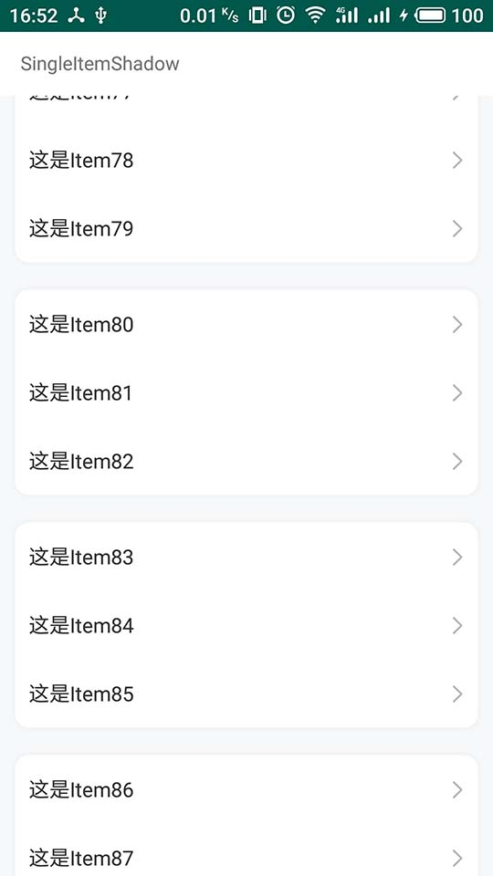
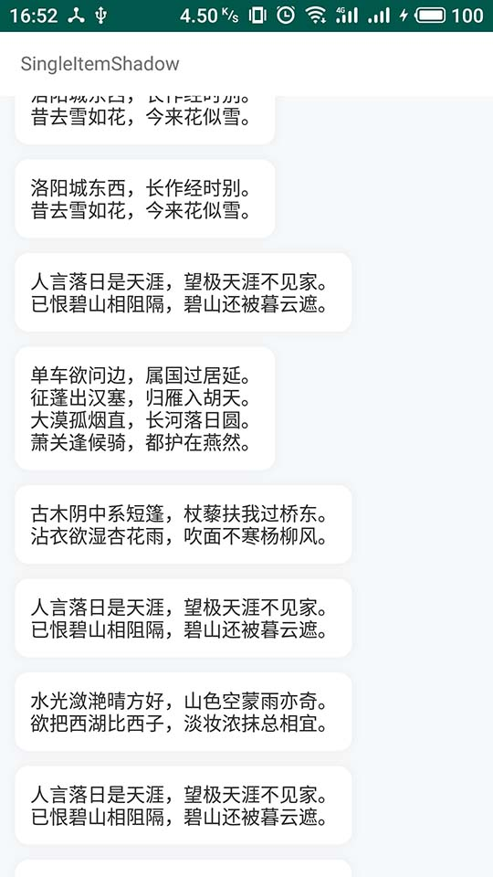

# ARecyclerShadow
Android RecyclerView阴影实现，基于AShadow2实现





## 使用
```
implementation 'com.mosect.AShadow:2.0.5'
implementation 'com.mosect.ARecyclerShadow:1.0.0'
```

## 更新记录

### 1.0.0
* LinerRoundShadow：线性布局，跨Item显示阴影
* ShadowItemDecoration：单个Item显示阴影
* SingleItemShadow：所有Item都使用同一个阴影显示

## 说明：
### ShadowItemDecoration
实现阴影显示的ItemDecoration，抽象类，需要实现getShadowKey方法，为Item提供一种阴影

### SingleItemShadow
继承于ShadowItemDecoration，如果整个RecyclerView的Item都使用一种阴影，可以使用此类对象为RecyclerView的Item显示阴影
```
// 创建阴影key
RoundShadow.Key shadowKey = new RoundShadow.Key();
shadowKey.solidColor = Color.parseColor("#ffffff");
shadowKey.shadowColor = Color.parseColor("#0d000000");
shadowKey.shadowRadius = TypedValue.applyDimension(TypedValue.COMPLEX_UNIT_DIP, 10,
        getResources().getDisplayMetrics());
shadowKey.radii = new float[8];
float round = TypedValue.applyDimension(TypedValue.COMPLEX_UNIT_DIP, 10,
        getResources().getDisplayMetrics());
Arrays.fill(shadowKey.radii, round);
// 创建item的阴影渲染器
SingleItemShadow itemShadow = new SingleItemShadow(shadowKey);
// 往RecyclerView添加渲染器
recyclerView.addItemDecoration(itemShadow);
```

### LinerRoundShadow
实现跨Item实现阴影的ItemDecoration，仅支持LinearLayoutManager布局。可以往LinerRoundShadow添加多个块（Block），每块都代表一个阴影，添加代码如下：
```
// 创建块阴影渲染器
LinerRoundShadow shadow = new LinerRoundShadow();
// 产生块阴影
LinearRoundShadow.Block block = shadow.block();
// 设置块位置
block.setStart(start).setEnd(end);
// 产生阴影key
RoundShadow.Key key = new RoundShadow.Key();
// 阴影圆角
float round = TypedValue.applyDimension(TypedValue.COMPLEX_UNIT_DIP, 10,
        getResources().getDisplayMetrics());
key.radii = new float[8];
Arrays.fill(key.radii, round);
// 阴影填充色
key.solidColor = Color.parseColor("#ffffff");
// 阴影半径
key.shadowRadius = TypedValue.applyDimension(TypedValue.COMPLEX_UNIT_DIP, 5,
        getResources().getDisplayMetrics());
// 阴影颜色
key.shadowColor = Color.parseColor("#0d000000");
// 将阴影信息设置到块阴影信息中
block.setShadowKey(key);

// 往RecyclerView添加渲染器
recyclerView.addItemDecoration(shadow);
```
如果Adapter的数据发生更改，LinerRoundShadow中块信息也需要更新，此时可以调用LinerRoundShadow.clearBlock方法清空之后再添加合适的块。

# AShadow2
[点这里可以查看AShadow2用法](https://github.com/Mosect/AShadow)

# 联系信息
```
QQ：905340954
邮箱：zhouliuyang1995@163.com
网站：http://www.mosect.com （建设中）
```
